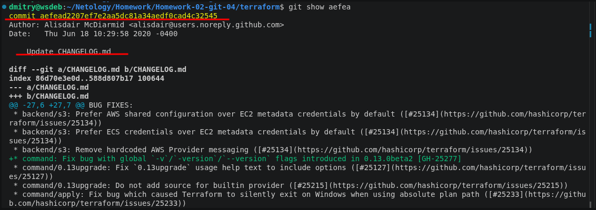
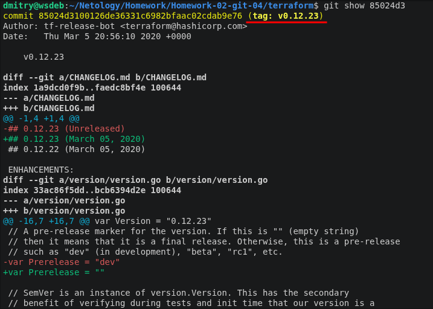
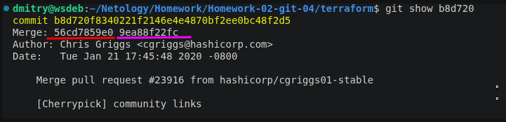
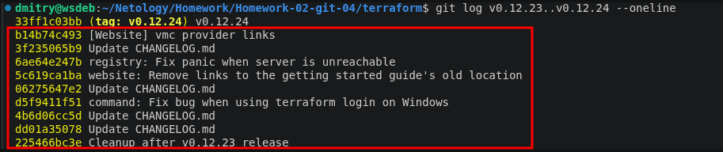
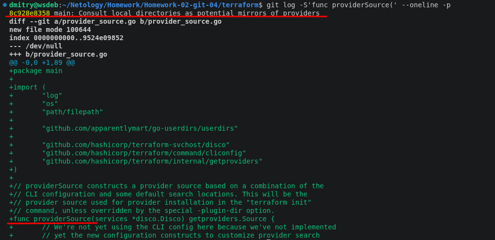
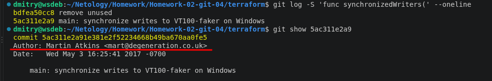

## Задание

В клонированном репозитории:

1. Найдите полный хеш и комментарий коммита, хеш которого начинается на `aefea`.



2. Ответьте на вопросы.

* Какому тегу соответствует коммит `85024d3`?



* Сколько родителей у коммита `b8d720`? Напишите их хеши.

У этого коммита 2 родителя. Хэши подчеркнуты разным цветом.



* Перечислите хеши и комментарии всех коммитов, которые были сделаны между тегами  v0.12.23 и v0.12.24.



* Найдите коммит, в котором была создана функция `func providerSource`, её определение в коде выглядит так: `func providerSource(...)` (вместо троеточия перечислены аргументы).



* Найдите все коммиты, в которых была изменена функция `globalPluginDirs`.

Следующая последовательность команд приводит к необходимому результату.
1. Первая команда находит коммиты с нужной функцией
2. Вторая команда выводит детали изменений с этой функцией. Где мы обнаруживаем изменение названия функции с globalPluginDirs на GlobalPluginDirs
3. Третья команда находит файл с этой функцией
4. Четвертая команда выводит изменения произведенные в функции

```bash
git log -S'func globalPluginDirs(' --all --oneline
git show 7c4aeac5f3 | grep -B3 -A3 globalPluginDirs
git grep 'func GlobalPluginDirs('
git log --oneline -L :GlobalPluginDirs:internal/command/cliconfig/plugins.go
```
[Ссылка на результат](/output)

* Кто автор функции `synchronizedWriters`?

Необходимо найти самый первый коммит, где появилась эта функция. Автор этого коммита и есть ответ на вопрос.



*В качестве решения ответьте на вопросы и опишите, как были получены эти ответы.*